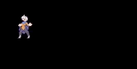

# LSA



Love sheet animator is a simple animator library responsible for holding animations created from one sprite-sheet, making easy the animations management.

## Example

```lua
local LSA = require 'lsa'

function love.load()
  playerSprite = love.graphics.newImage("player.png")
  -- Creates a new animator for the 'player.png' sprite-sheet, which have 12 frames (horizontally) and 7 frames (vertically)
  animator = LSA.new(playerSprite, 12, 7)
  -- Creates a new animation called idle which start in frame 1 and ends in frame 6
  animator:newAnimation('idle', 1, 6)
end

function love.update()
  -- If our animator isn't playing any animation, we start the 'idle' animation
  if (not animator.playing) then
    animator.play('idle')
  end
end

function love:draw()
  -- Draws our sprite in x = 32 and y = 32
  animator:draw(32, 32)
end
```

## API

```lua
  -- Creates an animator using the 'sprite', which is a sprite-sheet with 'hframes' frames horizontally and 'vframes' vertically
  playerAnimator = lsa.new(sprite, hframes, vframes)

  -- Creates an animation called 'name'. Speed and loop parameters are optional
  playerAnimator:newAnimation(name, start, ending, speed = 1, loop = true)

  --[[
    Starts playing animation 'name'
    reset is meant to start animation from it first frame
    if your animation to play is different from the previous one, the reset will occur even with reset set to false
  ]]-
  playerAnimator:play(name, reset = false)

  -- [[
    pause() method just pauses the animation, keeping the last rendered frame
    stop() method stops and return the animation to it's start
    if play() is called after pause(), the animation will continue from where it was interrupted
    if play() is called after stop(), the animation will play from it first frame
  ]]--
  playerAnimator:pause()
  playerAnimation:stop()

  -- it *must* receive the dt parameter to calculate the time between each frame accordingly to the previous defined speed
  playerAnimator:update(dt)

  -- draws your sprite, be it animated or not at the defined position
  playerAnimator:draw(x, y)
```
